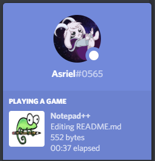

# NotepadRPC
A simple Notepad++ Discord Rich Presence written in Python.

## Installation
Make sure you have Python 3 installed with pip (https://pip.pypa.io/).

1. Download this repository.
2. Navigate to its directory.
3. Run `$ pip install -r requirements.txt`.
4. Run `$ python NotepadRPC.py`.

## Usage
You just have to run `$ python NotepadRPC.py` and that's it!

## Configuration
The configuration file is `config.yml`. This file is automatically generated by `NotepadRPC.py`. 

You can customize your settings by editing it.
